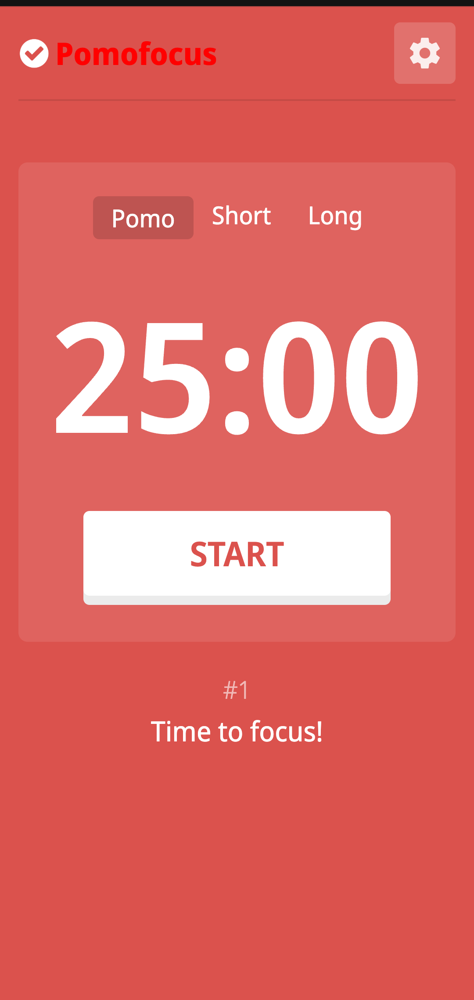

# Pomofocus Clone

> Pomodoro Timer



Pomofocus is a customizable pomodoro timer that works on desktop & mobile browser. The aim of this app is to help you focus on any task you are working on, such as study, writing, or coding. This app is inspired by Pomodoro Technique which is a time management method developed by Francesco Cirillo.

## Features

- Responsive design that works with desktop and mobile
- Color transition to switch moods between work time and rest time
- Audio notification at the end of a timer period
- Customizable timer intervals to suit your preference

## Built With

- React
- Redux

## Live Demo

[Live Demo Link](https://pomo.xuxintao.com/)

## Getting Started

To get a local copy up and running follow these simple example steps.

### Prerequisites

- NodeJS - [v16.x](https://nodejs.org/en/)
- [Yarn](https://yarnpkg.com/)

### Setup

```bash
git clone https://github.com/usmansbk/pomofocus.git
cd ./pomofocus
```

### Install

```bash
yarn
```

### Usage

```bash
yarn start
```

### Build

```bash
yarn build
```

### Run tests

```bash
yarn test
```
